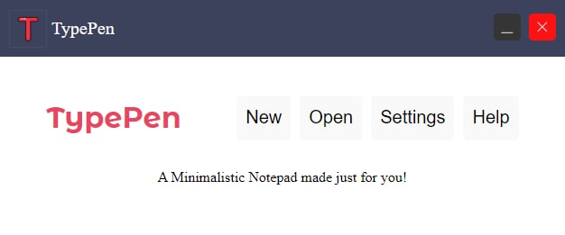

# TypePen
A Minimalistic Notepad made just for you

Take a look at the TODO.MD file to see where you can make a commit to this project

Have a look and feel of the application below

## FEATURES
- [x] Create/Save/Edit/Delete Notes
- [x] Save files with .typen Extension
- [x] View recent notes stored 

## Installation
```cmd
pip install -r requirements.txt
```

## HOW TO LAUNCH
```cmd
python app.py
```

## SCREENSHOTS

### `Main Application Window`



### `Notetaking route`


### AUTHOR
#### [HanslettTheDev](https://github.com/HanslettTheDev)